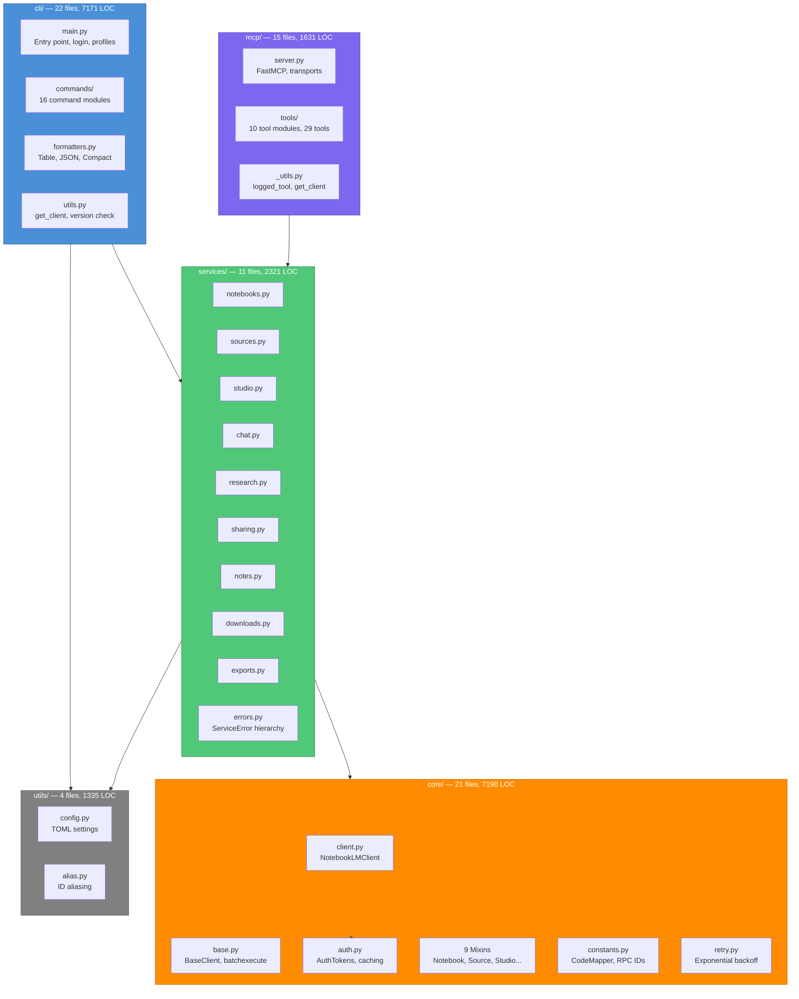
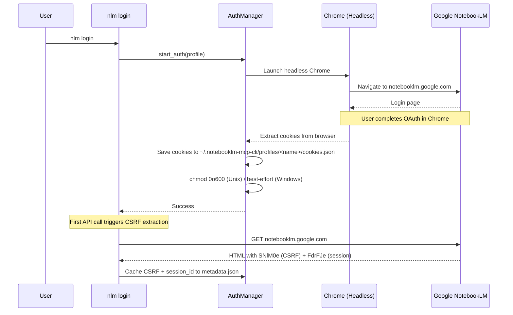
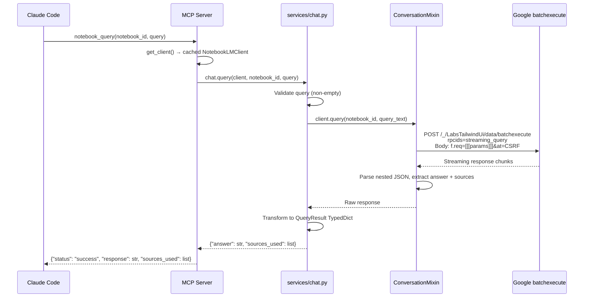
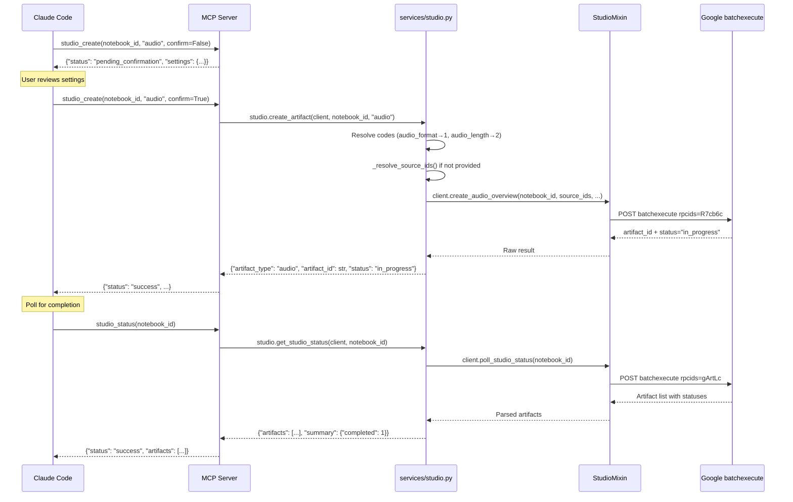
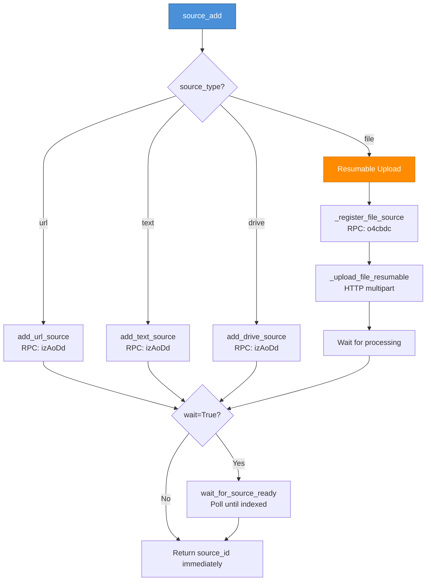

# Architecture Reference — notebooklm-mcp-cli

> Exhaustive technical reference for the notebooklm-mcp-cli codebase.
> Generated 2026-02-19 from automated analysis of all source modules.

---

## 1. Overview

**NotebookLM MCP Server & CLI** provides programmatic access to Google NotebookLM through an MCP (Model Context Protocol) server and a Typer-based CLI. It communicates with NotebookLM via Google's undocumented internal batchexecute RPC protocol.

| Metric | Value |
|--------|-------|
| Python files | 74 |
| Total LOC | ~19,650 |
| MCP tools | 29 |
| CLI commands | 50+ |
| RPC endpoints | 35+ |
| Test functions | 372 passed, 37 skipped |
| Python | >=3.11 |
| Build | hatchling |
| Entry points | `nlm` (CLI), `notebooklm-mcp` (MCP) |

---

## 2. Component Diagram



### Layering Rules

1. `cli/` and `mcp/` are **thin wrappers** — they handle UX (prompts, spinners, JSON) and delegate ALL logic to `services/`
2. `cli/` and `mcp/` must **NEVER import from `core/`** directly
3. `services/` returns `TypedDict` objects, raises `ServiceError` subclasses
4. `core/` contains low-level RPC calls, auth, and protocol handling

---

## 3. MCP Tools Map (29 Tools)

### Notebooks (6 tools)

| Tool | Parameters | Service Function | Description |
|------|-----------|-----------------|-------------|
| `notebook_list` | `max_results=100` | `notebooks.list_notebooks()` | List all notebooks with counts |
| `notebook_get` | `notebook_id` | `notebooks.get_notebook()` | Get notebook details + sources |
| `notebook_describe` | `notebook_id` | `notebooks.describe_notebook()` | AI-generated summary + topics |
| `notebook_create` | `title=""` | `notebooks.create_notebook()` | Create new notebook |
| `notebook_rename` | `notebook_id, new_title` | `notebooks.rename_notebook()` | Rename notebook |
| `notebook_delete` | `notebook_id, confirm=False` | `notebooks.delete_notebook()` | Delete permanently (requires confirm) |

### Sources (6 tools)

| Tool | Parameters | Service Function | Description |
|------|-----------|-----------------|-------------|
| `source_add` | `notebook_id, source_type, url?, text?, title?, file_path?, document_id?, doc_type="doc", wait=False` | `sources.add_source()` | Unified: URL, text, Drive, file |
| `source_list_drive` | `notebook_id` | `sources.list_drive_sources()` | List sources with Drive freshness |
| `source_sync_drive` | `source_ids[], confirm=False` | `sources.sync_drive_sources()` | Sync stale Drive sources |
| `source_delete` | `source_id, confirm=False` | `sources.delete_source()` | Delete permanently |
| `source_describe` | `source_id` | `sources.describe_source()` | AI summary + keywords |
| `source_get_content` | `source_id` | `sources.get_source_content()` | Raw text content |

### Studio (3 tools — unified creation)

| Tool | Parameters | Service Function | Description |
|------|-----------|-----------------|-------------|
| `studio_create` | `notebook_id, artifact_type, source_ids?, confirm=False, [20+ type-specific params]` | `studio.create_artifact()` | Create any of 9 artifact types |
| `studio_status` | `notebook_id, action="status", artifact_id?, new_title?` | `studio.get_studio_status()` / `studio.rename_artifact()` | List artifacts or rename |
| `studio_delete` | `notebook_id, artifact_id, confirm=False` | `studio.delete_artifact()` | Delete permanently |

**Artifact types:** audio, video, report, flashcards, quiz, infographic, slide_deck, data_table, mind_map

### Chat (2 tools)

| Tool | Parameters | Service Function | Description |
|------|-----------|-----------------|-------------|
| `notebook_query` | `notebook_id, query, source_ids?, conversation_id?, timeout?` | `chat.query()` | Query notebook sources |
| `chat_configure` | `notebook_id, goal="default", custom_prompt?, response_length="default"` | `chat.configure_chat()` | Configure chat behavior |

### Research (3 tools)

| Tool | Parameters | Service Function | Description |
|------|-----------|-----------------|-------------|
| `research_start` | `query, source="web", mode="fast", notebook_id?, title?` | `research.start_research()` | Start research discovery |
| `research_status` | `notebook_id, poll_interval=30, max_wait=300, compact=True` | `research.poll_research()` | Poll with blocking wait |
| `research_import` | `notebook_id, task_id, source_indices?[]` | `research.import_research()` | Import discovered sources |

### Sharing (3 tools)

| Tool | Parameters | Service Function | Description |
|------|-----------|-----------------|-------------|
| `notebook_share_status` | `notebook_id` | `sharing.get_share_status()` | Get sharing status + collaborators |
| `notebook_share_public` | `notebook_id, is_public=True` | `sharing.set_public_access()` | Toggle public link |
| `notebook_share_invite` | `notebook_id, email, role="viewer"` | `sharing.invite_collaborator()` | Invite collaborator |

### Downloads (1 unified tool)

| Tool | Parameters | Service Function | Description |
|------|-----------|-----------------|-------------|
| `download_artifact` | `notebook_id, artifact_type, output_path, artifact_id?, output_format="json"` | `downloads.download_async()` | Async download any artifact type |

### Exports (1 tool)

| Tool | Parameters | Service Function | Description |
|------|-----------|-----------------|-------------|
| `export_artifact` | `notebook_id, artifact_id, export_type, title?` | `exports.export_artifact()` | Export to Google Docs/Sheets |

### Notes (1 unified tool — 4 actions)

| Tool | Parameters | Service Function | Description |
|------|-----------|-----------------|-------------|
| `note` | `notebook_id, action (create\|list\|update\|delete), note_id?, content?, title?, confirm=False` | `notes.*()` | CRUD dispatcher |

### Auth & Server (3 tools)

| Tool | Parameters | Service Function | Description |
|------|-----------|-----------------|-------------|
| `refresh_auth` | *(none)* | `load_cached_tokens()` | Refresh authentication |
| `save_auth_tokens` | `cookies, csrf_token?, session_id?` | `save_tokens_to_cache()` | Manual token save |
| `server_info` | *(none)* | *(internal)* | Version + update check |

### Confirmation-Required Tools

These tools require `confirm=True` to execute destructive operations:
`notebook_delete`, `source_sync_drive`, `source_delete`, `studio_create`, `studio_delete`, `note` (delete action)

---

## 4. Data Flow Diagrams

### 4.1 Authentication Flow



### 4.2 Query Flow (MCP → batchexecute)



### 4.3 Studio Artifact Creation Flow



### 4.4 Source Addition Flow



---

## 5. RPC ID Reference

### Notebook Operations

| RPC ID | Operation | Mixin | Parameters |
|--------|-----------|-------|-----------|
| `wXbhsf` | List notebooks | NotebookMixin | *(none)* |
| `rLM1Ne` | Get notebook details/sources | NotebookMixin | `[notebook_id]` |
| `CCqFvf` | Create notebook | NotebookMixin | `[title]` |
| `s0tc2d` | Rename notebook / configure chat | NotebookMixin | `[notebook_id, title, goal, prompt, length]` |
| `WWINqb` | Delete notebook | NotebookMixin | `[notebook_id]` |
| `VfAZjd` | Get notebook summary + topics | NotebookMixin | `[notebook_id]` |

### Source Operations

| RPC ID | Operation | Mixin | Parameters |
|--------|-----------|-------|-----------|
| `izAoDd` | Add source (URL/text/Drive) | SourceMixin | `[notebook_id, type_params...]` |
| `o4cbdc` | Register file for upload | SourceMixin | `[notebook_id, filename]` |
| `hizoJc` | Get source content | SourceMixin | `[source_id]` |
| `tr032e` | Get source summary + keywords | SourceMixin | `[source_id]` |
| `yR9Yof` | Check Drive source freshness | SourceMixin | `[source_id]` |
| `FLmJqe` | Sync Drive source | SourceMixin | `[source_id]` |
| `tGMBJ` | Delete source | SourceMixin | `[source_id]` |

### Studio Operations

| RPC ID | Operation | Mixin | Parameters |
|--------|-----------|-------|-----------|
| `R7cb6c` | Create artifact (audio/video/report/etc.) | StudioMixin | `[notebook_id, source_ids, type_code, format_params...]` |
| `gArtLc` | Poll studio artifact status | StudioMixin | `[notebook_id]` |
| `V5N4be` | Delete studio artifact | StudioMixin | `[artifact_id]` |
| `rc3d8d` | Rename studio artifact | StudioMixin | `[artifact_id, new_title]` |
| `v9rmvd` | Get interactive HTML (quiz/flashcards) | StudioMixin | `[artifact_id]` |
| `yyryJe` | Generate mind map JSON | StudioMixin | `[notebook_id, source_ids]` |
| `CYK0Xb` | Save mind map / Create note | StudioMixin/NotesMixin | `[notebook_id, data]` |
| `cFji9` | List mind maps / List notes | StudioMixin/NotesMixin | `[notebook_id]` |
| `AH0mwd` | Delete mind map / Delete note | StudioMixin/NotesMixin | `[id, notebook_id]` |

### Research Operations

| RPC ID | Operation | Mixin | Parameters |
|--------|-----------|-------|-----------|
| `Ljjv0c` | Start fast research | ResearchMixin | `[notebook_id, query, source_code]` |
| `QA9ei` | Start deep research | ResearchMixin | `[notebook_id, query]` |
| `e3bVqc` | Poll research status | ResearchMixin | `[notebook_id]` |
| `LBwxtb` | Import research sources | ResearchMixin | `[notebook_id, task_id, indices]` |

### Sharing Operations

| RPC ID | Operation | Mixin | Parameters |
|--------|-----------|-------|-----------|
| `QDyure` | Set sharing / Add collaborator | SharingMixin | `[notebook_id, settings]` |
| `JFMDGd` | Get share status | SharingMixin | `[notebook_id]` |

### Notes Operations

| RPC ID | Operation | Mixin | Parameters |
|--------|-----------|-------|-----------|
| `CYK0Xb` | Create note | NotesMixin | `[notebook_id, content, title]` |
| `cFji9` | List notes | NotesMixin | `[notebook_id]` |
| `cYAfTb` | Update note | NotesMixin | `[note_id, content, title]` |
| `AH0mwd` | Delete note | NotesMixin | `[note_id, notebook_id]` |

### Export Operations

| RPC ID | Operation | Mixin | Parameters |
|--------|-----------|-------|-----------|
| `Krh3pd` | Export to Google Docs/Sheets | ExportMixin | `[notebook_id, artifact_id, type_code]` |

### Other (Unused/Internal)

| RPC ID | Operation | Status |
|--------|-----------|--------|
| `hPTbtc` | Get conversations | Defined but unused |
| `hT54vc` | User preferences | Defined but unused |
| `ozz5Z` | Subscription info | Defined but unused |
| `ZwVcOc` | User settings | Defined but unused |

> **Note:** RPC IDs `CYK0Xb`, `cFji9`, `AH0mwd` are shared between mind maps and notes operations, differentiated by parameters.

---

## 6. Core Architecture Details

### 6.1 Mixin Composition

```python
# core/client.py
class NotebookLMClient(
    ExportMixin,      # export_artifact, export_data_table_to_sheets, export_report_to_docs
    DownloadMixin,    # download_audio, download_video, download_report, ... (15+ methods)
    StudioMixin,      # create_audio_overview, create_video, poll_studio_status, ... (30+ methods)
    ResearchMixin,    # start_research, poll_research, import_research_sources
    ConversationMixin,# query, clear_conversation, get_conversation_history
    SourceMixin,      # add_url_source, add_text_source, delete_source, ... (10+ methods)
    SharingMixin,     # get_share_status, set_public_access, add_collaborator
    NotebookMixin,    # list_notebooks, create_notebook, rename_notebook, ...
    NotesMixin,       # create_note, list_notes, update_note, delete_note
):
    pass  # All functionality from mixins + BaseClient
```

### 6.2 Batchexecute Protocol

All API calls (except query/chat) use Google's internal batchexecute protocol:

```
POST https://notebooklm.google.com/_/LabsTailwindUi/data/batchexecute
    ?rpcids=RPC_ID&source-path=/&bl=BUILD_VERSION&hl=en&rt=c&f.sid=SESSION_ID

Content-Type: application/x-www-form-urlencoded
Body: f.req=[[[RPC_ID, JSON_PARAMS, null, "generic"]]]&at=CSRF_TOKEN&
```

**Response format:**
```
)]}'\n
BYTE_COUNT\n
[["wrb.fr", "RPC_ID", "JSON_RESULT_STRING", ...], ...]
```

**Auth recovery (3-layer):**
1. Refresh CSRF token from homepage HTML
2. Reload cookies from disk cache
3. Run headless Chrome re-authentication

### 6.3 CodeMapper Constants

Bidirectional mapping between human-readable names and API integer codes:

| Mapper | Example Entries |
|--------|----------------|
| `STUDIO_TYPES` | audio(1), report(2), video(3), flashcards(4), infographic(7), slide_deck(8), data_table(9) |
| `AUDIO_FORMATS` | deep_dive(1), brief(2), critique(3), debate(4) |
| `VIDEO_STYLES` | auto_select(1), classic(3), whiteboard(4), kawaii(5), anime(6), watercolor(7) |
| `SOURCE_TYPES` | google_docs(1), pdf(3), pasted_text(4), web_page(5), youtube(9), uploaded_file(11) |
| `RESEARCH_MODES` | fast(1), deep(5) |
| `SHARE_ROLES` | owner(1), editor(2), viewer(3) |
| `EXPORT_TYPES` | docs(1), sheets(2) |

### 6.4 Error Hierarchies

**Core errors (API-level):**
```
NotebookLMError
├── ArtifactError
│   ├── ArtifactNotReadyError
│   ├── ArtifactParseError
│   ├── ArtifactDownloadError
│   └── ArtifactNotFoundError
└── ClientAuthenticationError
```

**Service errors (business logic):**
```
ServiceError (user_message + debug_code)
├── ValidationError
├── NotFoundError
├── CreationError
└── ExportError
```

**CLI errors (user-facing with hints):**
```
NLMError (message + hint)
├── AuthenticationError
├── NotFoundError
├── ValidationError
├── NetworkError
├── RateLimitError
├── ConfigError
├── ProfileNotFoundError
├── FileUploadError
└── FileValidationError
```

---

## 7. Service Layer TypedDicts

### Notebooks
- `NotebookInfo` — id, title, source_count, url, ownership, is_shared, created_at, modified_at
- `NotebookListResult` — notebooks[], count, owned_count, shared_count, shared_by_me_count
- `NotebookDetailResult` — notebook_id, title, source_count, url, sources[]
- `NotebookSummaryResult` — summary, suggested_topics[]
- `NotebookCreateResult` — notebook_id, title, url, message
- `NotebookRenameResult` — notebook_id, new_title, message
- `NotebookDeleteResult` — message

### Sources
- `AddSourceResult` — source_type, source_id, title
- `DriveSourceInfo` — id, title, type, stale?, drive_doc_id?
- `DriveListResult` — drive_sources[], other_sources[], drive_count, stale_count
- `SyncResult` — source_id, synced, error?
- `DescribeResult` — summary, keywords[]
- `SourceContentResult` — content, title, source_type, char_count

### Studio
- `CreateResult` — artifact_type, artifact_id, status, message
- `MindMapResult` — artifact_type, artifact_id, title, root_name, children_count, message
- `ArtifactInfo` — artifact_id, type, title, status, created_at, url
- `StatusResult` — artifacts[], total, completed, in_progress
- `RenameResult` — artifact_id, new_title

### Chat
- `QueryResult` — answer, conversation_id?, sources_used[]
- `ConfigureResult` — notebook_id, goal, response_length, message

### Research
- `ResearchStartResult` — task_id, notebook_id, query, source, mode, message
- `ResearchStatusResult` — status, notebook_id, task_id?, sources_found, sources[], report, message?
- `ResearchImportResult` — notebook_id, imported_count, imported_sources[], message

### Sharing
- `CollaboratorInfo` — email, role, is_pending, display_name?
- `ShareStatusResult` — notebook_id, is_public, access_level, public_link?, collaborators[], collaborator_count
- `PublicAccessResult` — notebook_id, is_public, public_link?, message
- `InviteResult` — notebook_id, email, role, message

### Notes
- `NoteInfo` — id, title, preview
- `NoteListResult` — notebook_id, notes[], count
- `NoteCreateResult` — note_id, title, content_preview, message
- `NoteUpdateResult` — note_id, updated, message
- `NoteDeleteResult` — note_id, message

### Downloads & Exports
- `DownloadResult` — artifact_type, path
- `ExportResult` — status, notebook_id, artifact_id, export_type, url, message

---

## 8. Test Coverage Summary

| Layer | Files | Tests | Coverage | Quality |
|-------|-------|-------|----------|---------|
| **services/** | 10 | ~157 | 100% functions | Excellent — happy paths, errors, edge cases |
| **core/** | 14 | ~48 | 70% | Moderate — RPC ID checks, weak response parsing |
| **cli/** | 1 | 6 | Minimal | Only output format detection |
| **mcp/** | 0 | 0 | None | E2E only (skipped by default) |
| **Total** | 32 files | 372 | | |

**Key gaps:** No MCP tool unit tests (29 tools), no CLI command tests (50+ commands), weak core response parsing tests.

---

## 9. Gap Analysis & Improvements

### 9.1 Critical Issues

| # | Issue | Location | Impact |
|---|-------|----------|--------|
| 1 | **Shared RPC IDs** — `CYK0Xb`, `cFji9`, `AH0mwd` shared between mind maps and notes with different parameter structures | core/notes.py, core/studio.py | Fragile dispatching; API changes could break both |
| 2 | **Response parsing fragility** — Hardcoded array indices for extracting URLs/data from nested lists | core/studio.py (poll_studio_status) | If Google changes response format, silent data corruption |
| 3 | **No MCP tool unit tests** — 29 tools with zero unit test coverage | tests/ | Silent regressions when services change |
| 4 | **Inconsistent research_status response** — Returns raw service result instead of `{"status": "success", **result}` | mcp/tools/research.py | Different structure than other tools |

### 9.2 Architecture Improvements

| # | Improvement | Priority | Phase |
|---|-----------|----------|-------|
| 1 | **Add MCP tool unit tests** — Mock get_client(), test response formatting + error paths | HIGH | Phase 3 |
| 2 | **Add core response parsing tests** — Test nested list parsing for each mixin | HIGH | Phase 3 |
| 3 | **Create shared conftest.py** — mock_client, e2e_client fixtures; auto-reset MCP client cache | HIGH | Phase 3 |
| 4 | **Add CLI command tests** — Test argument parsing, error display, exit codes | MEDIUM | Phase 3 |
| 5 | **Standardize error messages** — Enforce `user_message` on ALL ServiceError raises | MEDIUM | Phase 4 |
| 6 | **Extract shared polling utility** — Research and studio both need polling; DRY it up | LOW | Phase 4 |

### 9.3 LLM Consumption Improvements (Phase 4)

| # | Improvement | Description |
|---|-----------|-------------|
| 1 | **Structured query responses** | Include source attribution per-paragraph, not just a source list |
| 2 | **Response metadata** | Add `confidence`, `source_count`, `response_time` to query results |
| 3 | **Cross-notebook search** | Query multiple notebooks in one call, merge results |
| 4 | **Compact report truncation configurable** | Currently hardcoded 500 chars; make parameterizable |
| 5 | **Batch operations** | Create multiple sources/notes in one call |
| 6 | **Notebook URL in all tool responses** | Currently inconsistent across tools |

### 9.4 Notebook Organization Improvements (Phase 5)

| # | Improvement | Description |
|---|-----------|-------------|
| 1 | **Tag/category system** | Local metadata layer for tagging notebooks by domain |
| 2 | **Cross-notebook query** | Search across multiple notebooks simultaneously |
| 3 | **Notebook groups** | Group notebooks by project/domain for batch operations |
| 4 | **Smart search** | Full-text search across notebook titles and source titles |

### 9.5 Windows-Specific Issues

| # | Issue | Status |
|---|-------|--------|
| 1 | Rich Console cp1252 encoding | FIXED — `Console(legacy_windows=False)` on all 19 instances |
| 2 | File path separator in source title fallback | OPEN — `str(file_path).split("/")` assumes Unix separators |
| 3 | Cookie file permissions (chmod 0o600) | MITIGATED — try/except OSError for Windows |
| 4 | Chrome path detection hardcoded | OPEN — Won't find Chrome in custom locations |
| 5 | uv tool reinstall doesn't pick up changes | DOCUMENTED — Use `uv tool uninstall && uv cache clean && uv tool install --force --reinstall .` |

### 9.6 Security Findings (from Phase 0 Audit)

| # | Finding | Severity | Status |
|---|---------|----------|--------|
| 1 | Cookie file permissions too open | HIGH | FIXED — chmod 0o600 added |
| 2 | Debug logging exposes user content | HIGH | FIXED — truncated to 500 chars |
| 3 | Cookies stored in plaintext | MEDIUM | OPEN — consider Fernet encryption |
| 4 | Chrome `--remote-allow-origins=*` | MEDIUM | OPEN — required for headless auth |
| 5 | Pre-commit hook for secrets | LOW | INSTALLED — scripts/pre-commit-secrets.sh |

---

## 10. CLI Command Reference (Quick Index)

### Core CRUD
```
nlm notebook list|create|get|describe|rename|delete|query
nlm source list|add|get|describe|content|delete|stale|sync
nlm note list|create|update|delete
nlm chat configure|start
```

### Studio & Downloads
```
nlm audio|video|report|quiz|flashcards|slides|mindmap|infographic|data-table create
nlm studio status|delete|rename
nlm download audio|video|report|mind-map|slide-deck|infographic|data-table|quiz|flashcards
```

### Research & Sharing
```
nlm research start|status|import
nlm share status|public|private|invite
nlm export artifact|to-docs|to-sheets
```

### System
```
nlm login [--check] [--manual]
nlm login profile list|delete|rename
nlm login switch PROFILE
nlm setup add|remove|list CLIENT
nlm skill install|uninstall|list|update|show TOOL
nlm doctor [--verbose]
nlm alias set|get|list|delete
nlm config show|get|set
```

### Verb-first aliases
```
nlm create notebook|source|note
nlm list notebooks|sources|notes
nlm delete notebook|source|note
nlm describe notebook|source
nlm query notebook
nlm download audio|video|...
```
